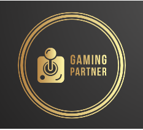

<h1 align="center">
	
</h1>

<h3 align="center">
  Project developed back-end
</h3>

<p align="center">
  <a href="#-project">Project</a>&nbsp;&nbsp;&nbsp;|&nbsp;&nbsp;&nbsp;
  <a href="#-technologies">Technologies</a>&nbsp;&nbsp;&nbsp;|&nbsp;&nbsp;&nbsp;
  <a href="#-how-to-use">How to Use</a>&nbsp;&nbsp;&nbsp;|&nbsp;&nbsp;&nbsp;
  <a href="#-license">License</a>
</p>

<br/>

## 💻 Project

The experience of playing online is immensely pleasurable when we can share this experience with friends, but even living in such a connected time, we still have people who don't meet to play together, and who can often end up giving up on the experience because they face it alone. may not be the most profitable, especially in online games.


At first our application will allow people to choose their favorite games, and to find other players with the same objective, to win!!

## 🚀 Technologies

This project was developed with the main following technologies:

- [Node.js](https://nodejs.org/en/)
- [Docker](https://docs.docker.com)

## ℹ️ How To Use

To clone and run this application, you'll need [git](https://git-scm.com), [npm](https://www.npmjs.com/), [yarn](https://classic.yarnpkg.com/lang/en/docs/), [node](https://nodejs.org/en/). 
<br/>Node version used in this project: `16.17.0`
<br/>From your command line:

- [Documentation](https://documentation-one-red.vercel.app)
```bash
# Clone the repository
$ git clone https://github.com/pb-node-equipe-15/gaming-partner
```

### ⚙️ Server API

```bash
# Go into the repository
$ cd gaming-partner

# Install dependencies
$ yarn install

# Run the development server
$ yarn run dev

```

## 📝 License

This project is under the MIT license. See the [LICENSE](LICENSE.md) for more information.

---

Made with ♥ by pb-node-equipe-15 - [Get in touch](https://github.com/pb-node-equipe-15)
